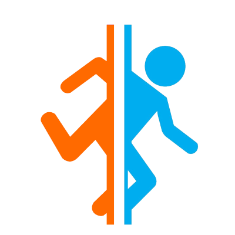

<div align="center">
  
  <h1><b>Portal Coop</b></h1>
  <h3>Collaborative environment in the Aperture Science laboratory</h3>
</div>

</br></br>

# 📝 Description of the project

Project realised in the IEVA module (Interaction with Virtual or Augmented Reality Environments) of my dual degree SIIA (Intelligent and Autonomous Interactive System).
This project was about successfully setting up multi-user interactions in a virtual world. For example by implementing interactions with objects that cannot be done by a single user.

To achieve this, Unity3D was used to create the virtual world and Photon has been used to synchronise all the actions across the different machines.

> ### [A WebGL version of the project is available here.](https://dleveque.github.io/Portal-coop/) 
> To play, simply open this same link in two windows.

# 🎬 Demonstration videos

A video is available [here](https://github.com/dleveque/Portal-coop/raw/master/Portal-coop.mp4)

# ♠ Aim of the game

You are in a test room of the famous Aperture Science laboratory.This test is designed to test your ability to interact and collaborate with others in a virtual world through their respective avatars.

__You will need to analyse the different elements that make up the room in order to understand how to exit the room and reach the lift on the other side of the door.__

Be aware that the cube and the player have a mass, the big button near the door is weight-sensitive, and the force field only destroys unauthorised objects (such as cubes) but not the players.

In addition, a synchronisation room has been added behind the first door. It is the next one that gives access to the lift. This allows to avoid the sacrifice of one of the players and to check that he does not stay on the big button to let the players leave the test area.

Will you be able to solve the puzzle and reach the lift?

# 🎮 Control

> - Directional arrows for moving around
> - Mouse + left click and hold to move the cursor.
> - B key to interact / grasp an object
> - N key to release the object
> - C key to send a help message to be carried
> - V key to send a "look at to" message

# 🤝 Choice of the type of co-manipulation

For the object to be handled, I chose to keep the example that was provided at the beginning of the project with a cube. I then replaced it with a 3D model.

To be able to co-manipulate the cube, I constrained it with a notion of weight. Each user is provided with a tool, an anti-gravitational generator, allowing them to remove a certain amount of mass from the cube in order to lift it. Of course, the more tools they have to manipulate the cube, the higher it can be lifted.

All users can perform the same actions on the cube. Their actions are averaged to position the cube in space and summed for the rotation of the object.

# 👀 Interaction Awareness 

The user can interact on the objects in the environment using his cursor.
An interaction area is highlighted when the cursor is inside. Coloured blue to indicate that the user is hovering over it and orange when interacting with it.
In addition, a pop-up appears at the bottom of the screen to indicate the action  to interact with the object.

For example, for the button located in the room, when you approach the cursor on the top of the button, a blue sphere appears with a message indicating that to interact with it, you must press the 'B' key.
Likewise to manipulate the cube via one of its interfaces on each of its faces ('B' for catch and 'N' for release).

To make it clear that the object is too heavy, I chose that once it reached a certain height the cube would start to vibrate to simulate the fact that the antigravitational generator can no longer lift it. If the user persists, the interface on which he interacts moves away from the cube and goes out of its reach. The cube regains the effects of gravity and falls back to the ground.
The user is then forced to call another user for help.

# 📣 Sending a help message

To send a help message, you can send iconic messages in the virtual environment at any time. In this version, two icons are present:
  
  -  Allows the other user to manipulate the cube as well. Can be sent by pressing the 'C' key.
  -  Allows you to tell the other user a particular area to be viewed. Can be sent by pressing the 'V' key.

Once sent, the icon will point in the direction of the tool and will stop at the first solid obstacle. Furthermore, the icon will take on the colour of the user who sent it to indicate to the others the sender of the message.

This colour is assigned automatically at the start of the game and is applied to the tool and cursor.

# 🧭 Test room

By playing with a cube during the design of the project, it reminded me a specific video game edited by Valve called Portal. It's a puzzle game where the player has to solve enigmas to move from room to room. Wishing one day to make a game with Unity and knowing that the subject of the project was to make a challenge to several users, I decided to do a little more. Especially since the community had created an incredible number of free and open access 3D models.

So I decided to add 3D models and textures to improve immersion and interaction. Indeed, when I tested the level with my friends and family, I realised that it was quite common for the user to lose his cursor. So in order to avoid forcing the cursor out of the field of vision, I decided to add a 3D generator model that fixes the cursor. This way the user knows where his cursor is by looking at his tool.


# 📂 Contents of the repository

    |-Assets: All the assets of the 3D world
    |-Build: Build the project in WebGl
    |-Portal-coop.mp4: demonstration video
    |-Readme.md: micro report 

# 📦 Installation

1. Install Unity3D in version 2019.3.0f3 [Unity](https://unity3d.com/fr/get-unity/download/archive)

2. Clone the GitHub repository to your directory
```bash
git clone https://github.com/dorianleveque/Portal-coop.git
```

3. Go to the directory using a terminal
```bash
cd Portal-coop
```

# 📜 Execution

To execute the project, just add the project to Unity Hub and launch it in the right version.