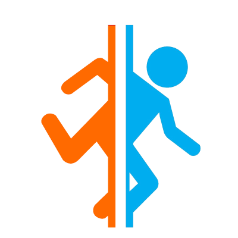
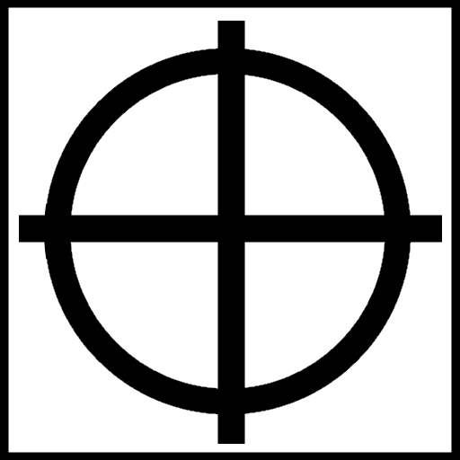

<div align="center">
  
  <h1>
      <b>
        Portal Coop
      </b>
  </h1>
  <h3></h3>
</div>

</br></br>

# Description du projet

Projet réalisé au sein du module IEVA (Interaction avec les Environnements de réalité Virtuelle ou Augmentée) de mon double diplome SIIA (Système Interactif Intelligent et Autonome).
Il était question dans ce projet de réussir à mettre en place des interactions multi-utilisateurs dans un monde virtuel. Par exemple en mettant en place des interactions avec des objets qui ne peuvent pas être faites à un seul utilisateur.

Pour réaliser cela, nous avons utilisé Unity3D pour créer le monde virtuel et Photon pour synchroniser l'ensemble des actions à travers les différentes machines.


# Choix du type de co-manipulation
Pour l'objet à manipuler, j'ai choisi de conserver l'exemple qui a été fourni en début de projet avec un cube. J'ai par la suite remplacé de dernier par un modele 3D. 

Pour réussir à faire une co-manipulation du cube, j'ai contrain ce dernier avec une notion de poid. Chaque utilisateur est muni d'un outil, un générateur antigravitationnelle, leur permettant de pouvoir retirer une certaine quantité de masse au cube pour pouvoir le soulever. Bien entendu, plus il a d'outil qui manipule le cube, plus on peut le soulever haut.

Tous les utilisateurs peuvent effectuer les mêmes actions sur le cube. Leurs actions sont moyenner pour positionner le cube dans l'espace et sommer pour la rotation de l'objet.

# Awareness d'interaction 

Pour tout les objets sur lesquelle l'utilisateur peut interagir via son curseur, j'ai choisi de mettre en surbrillance la zone d'interaction. Elle se colore en bleu lorsque le curseur de l'un des utilisateurs la survole et en orange lorsqu'il interagit avec.
De plus une popup apparait en bas de l'écran pour indiquer l'action a effectuer pour interragir avec l'objet.

Par exemple pour le bouton situé dans la pièce, lorsqu'on s'approche du bouton rouge, une sphère bleu apparait avec un message indiquant que pour interagir il faut appuyer sur la touche 'B'.
De même pour manipuler le cube via l'une de ses interfaces disposé sur chacune de ses faces ('B' pour attraper et 'N' pour relâcher)

Pour faire comprendre que l'objet est trop lourd, j'ai choisi qu'à partir d'une certaine hauteur le cube se mettrait à vibrer pour simuler le fait que le générateur antigravitaionnelle n'a plus la capacité de le soulever. Si l'utilisateur persiste, l'interface sur laquelle il interagie s'éloigne du cube et sort de sa porté. Le cube retrouve les effets de la pesanteur et retombe au sol.
L'utilisateur est contraint à appeler à l'aide un autre utilisateur pour l'aider.

# Envoi de message d'aide

Pour envoyé un message d'aide, il est possible d'envoyer à tout moment des messages sous formes d'icone dans l'environnement virtuel pour véhiculer un message à l'autre utilisateur. Dans cette version, deux icones sont présentes:
  
  -  Permet d'inciter l'autre utilisateur à manipuler lui aussi le cube. Envoi possible en appuyant sur la touche 'C'.
  -  Permet d'indiquer à l'autre utilisateur une zone à regarder en particulier. Envoi possible en appuyant sur la touche 'V'.

Une fois envoyé, l'icone se dirigera dans la direction que pointe l'outil et s'arrêtera au premier obstacle solide. De plus l'icône prendra la couleur de l'utilisateur qui l'a envoyé pour indiqué aux autres l'expéditeur du message.

Cette couleur est attribué automatiquement dès le début de la partie et s'applique sur l'outil et le curseur.

# Niveau

Après avoir développer les fonctionnalités énoncées plus haut, j'ai souhaité faire une salle 

# Videos de démonstration

<video width=600  height=300 controls>
  <source src="./Portal-coop.mp4" type="video/mp4">
</video>

# 📂 Contenu du répertoire

    |-Assets: L'ensemble des assets du monde 3D
    |-Build: Build du projet sous WebGl
    |-Portal-coop.mp4: vidéo de démonstration
    |-ReadMe.md: micro rapport 

# 📦 Installation du projet

1. Installer Unity3D dans sa version 2019.3.0f3 [Unity](https://unity3d.com/fr/get-unity/download/archive)

2. Cloner le dépôt GitLab sur votre répertoire
```bash
git clone https://gitlab.com/Dorian44/portal-coop.git
```

3. Se rendre dans le répertoire à l'aide d'un terminal
```bash
cd portal-coop
```

# 📜 Execution du projet

Pour executer le projet, il suffit d'ajouter le projet à Unity Hub et de le lancer dans la bonne version